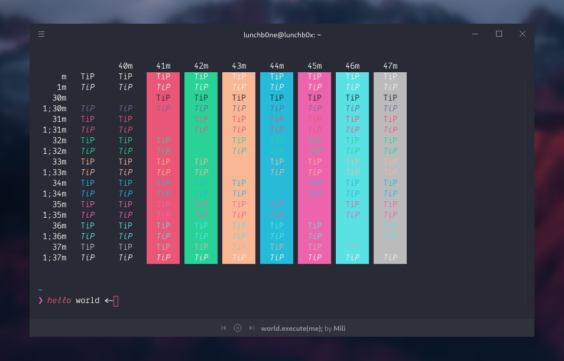

<h1 align="center">
Hyper-Horizon
</h1>

<h4 align="center">
A hyper theme based on a Visual Stuido Code theme of the same name.
</h4>


<div align="center">
  
</div>


## Contents

- [Install](#install)
- [Extra](#extra)
- [Related](#related)

## Install

### Hyper Store

Get the theme on the official [Hyper Store](https://hyper.is/plugins/hyper-italichorizon).

### Hyper plugin manager

Firstly, ensure you have [Hyper](https://hyper.is) installed in your system. Once launched, type the following to get the theme.

```zsh
$ hyper install hyper-italichorizon
```

## Extra

To get the exact same look, install the [Dank Mono](https://Dank.sh) font , [Ligature Support](https://github.com/tolbertam/hyper-font-ligatures) as well as [oh-my-zsh](http://ohmyz.sh/) and set up [pure](https://github.com/sindresorhus/pure) as your zsh prompt.

## Related

- [horizon-theme-vscode](https://github.com/jolaleye/horizon-theme-vscode) - vscode version of the theme
